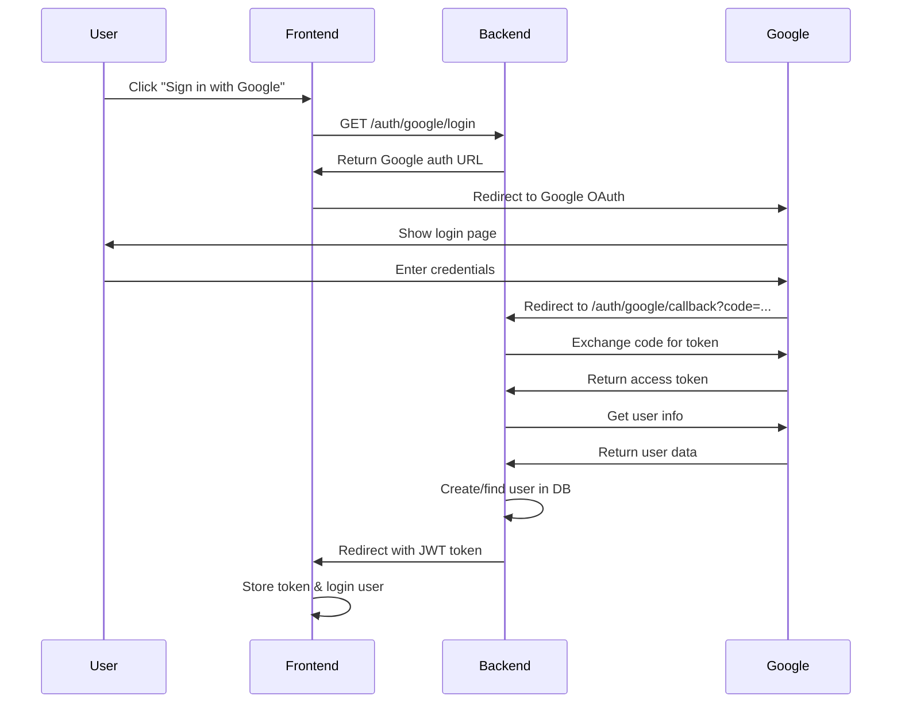

# Google OAuth Setup Guide

## Problem Identified

**Error**: `400: redirect_uri_mismatch`

The Google OAuth redirect URI `http://localhost:8000/auth/google/callback` is not authorized in your Google Cloud Console for the OAuth client ID you're using.

## Solution: Add Redirect URI to Google Cloud Console

### Step 1: Open Google Cloud Console

1. Go to [Google Cloud Console](https://console.cloud.google.com/)
2. Select your project (or create one if needed)

### Step 2: Configure OAuth Consent Screen

1. Navigate to **APIs & Services** → **OAuth consent screen**
2. If not configured, set up the consent screen:
   - Choose **External** (for testing) or **Internal** (for organization use)
   - Fill in required fields:
     - App name: `UDX`
     - User support email: Your email
     - Developer contact: Your email
   - Click **Save and Continue**
3. Add scopes (optional for testing):
   - `openid`
   - `email`
   - `profile`
4. Add test users if using External type:
   - Add your email address
5. Click **Save and Continue**

### Step 3: Configure OAuth Credentials

1. Navigate to **APIs & Services** → **Credentials**
2. Find your OAuth 2.0 Client ID or create a new one:
   - Click **+ CREATE CREDENTIALS** → **OAuth client ID**
   - Application type: **Web application**
   - Name: `UDX Backend`

3. **Add Authorized Redirect URIs** (CRITICAL):
   ```
   http://localhost:8000/auth/google/callback
   http://127.0.0.1:8000/auth/google/callback
   ```

4. **Add Authorized JavaScript origins** (optional but recommended):
   ```
   http://localhost:3000
   http://localhost:8000
   ```

5. Click **Create** or **Save**

6. Copy your credentials:
   - **Client ID**: `YOUR_GOOGLE_CLIENT_ID`
   - **Client Secret**: `YOUR_GOOGLE_CLIENT_SECRET`

### Step 4: Update .env File

Your `.env` file already has these credentials. Verify they match:

```bash
GOOGLE_CLIENT_ID=YOUR_GOOGLE_CLIENT_ID
GOOGLE_CLIENT_SECRET=YOUR_GOOGLE_CLIENT_SECRET
GOOGLE_REDIRECT_URI=http://localhost:8000/auth/google/callback
```

### Step 5: Test the Flow

1. Restart your backend server (if needed):
   ```bash
   # The server should auto-reload, but if not:
   # Stop the current server (Ctrl+C) and restart
   ```

2. Open your app: http://localhost:3000

3. Click "Get Started" → "Sign in with Google"

4. You should now be redirected to Google's login page successfully

## Current OAuth Flow



## Troubleshooting

### Error: "Access blocked: This app's request is invalid"
- Make sure you've added your email as a test user in OAuth consent screen
- Verify the app is in "Testing" mode if using External user type

### Error: "redirect_uri_mismatch" persists
- Double-check the redirect URI is **exactly**: `http://localhost:8000/auth/google/callback`
- No trailing slashes
- Use `http://` not `https://` for localhost
- Wait a few minutes after saving changes in Google Cloud Console

### Error: "invalid_client"
- Verify your Client ID and Client Secret in `.env` match Google Cloud Console
- Make sure there are no extra spaces or quotes in the `.env` file

### Frontend doesn't redirect to Google
- Check browser console for errors
- Verify the backend endpoint `/auth/google/login` returns a valid auth URL
- Test directly: http://localhost:8000/auth/google/login

## Security Notes

⚠️ **Important**: The credentials in your `.env` file are currently exposed. For production:

1. **Never commit `.env` to version control** (already in `.gitignore` ✅)
2. **Rotate your Client Secret** if it's been exposed publicly
3. **Use environment variables** in production deployment
4. **Restrict OAuth scopes** to only what you need
5. **Add production redirect URIs** when deploying (e.g., `https://yourdomain.com/auth/google/callback`)

## Testing Checklist

- [ ] Added redirect URI to Google Cloud Console
- [ ] Verified credentials in `.env` file
- [ ] Restarted backend server (if needed)
- [ ] Tested Google login flow
- [ ] Verified user is created in database
- [ ] Checked JWT token is returned to frontend
